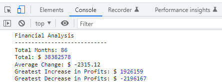

# Java Script Challenge

Created by &copy;Sergejs Hamjonoks.

## Project Description

Java Script Challenge using array and math methods to solve given problem.


## Screenshots




## Demo

https://heretotroll.github.io/Console-Finances/

## Technologies used

Basic Java Script 


## License

[MIT](https://choosealicense.com/licenses/mit/)

## Installation

Install Challenge1 with Git Bash

1.Open Git Bash.  
2.Change the current working directory to the location where you want the project to be installed.


```bash
  cd DesiredProjectLocation
  git clone https://github.com/HereToTroll/Console-Finances.git
```
    